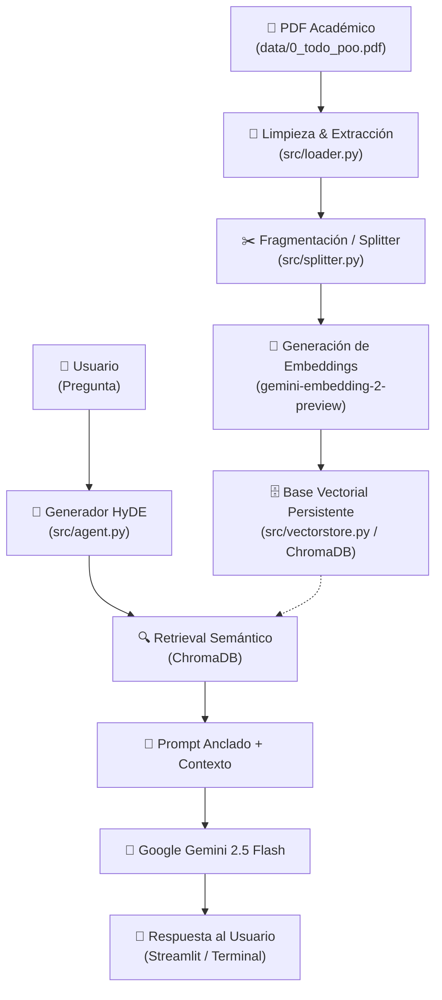

# 🤖 Agente POO — Asistente Académico con RAG Semántico

[](https://streamlit.app)
[](https://python.org)
[](https://google.dev)
[](https://trychroma.com)
[](LICENSE)

Un sistema **RAG** (*Retrieval-Augmented Generation*) inteligente y robusto, diseñado con arquitectura modular de **Programación Orientada a Objetos**. Este asistente procesa y analiza material académico en PDF (`0_todo_poo.pdf`) para responder preguntas técnicas sobre POO de forma precisa, citando únicamente contexto verificado y evitando alucinaciones.

---

## 🌐 Demo en Vivo

El proyecto ya se encuentra desplegado y listo para usar en la nube. Puedes interactuar con el asistente web de forma inmediata a través del siguiente enlace:

🚀 **[Acceder al Agente POO en Streamlit Community Cloud](https://2agentepoo-9tvgyhbtwkywuqsbnbsrjj.streamlit.app/)**

> ⚠️ **Nota para usuarios de la Demo:** Para interactuar con el agente en la nube, asegúrate de ingresar tu propia `GEMINI_API_KEY` en el panel de configuración de la barra lateral (Sidebar) de la aplicación.

---

## 🎯 Características Principales

* 🧠 **Búsqueda Vectorial Optimizada (HyDE):** Utiliza *Hypothetical Document Embeddings* (HyDE) para generar un fragmento académico previo a la búsqueda, maximizando la relevancia semántica de los resultados recuperados.
* 🛡️ **Anclaje Estricto de Contexto:** Garantiza que las respuestas provengan **exclusivamente** del material de estudio cargado; si el tema no se encuentra en el documento, lo notifica explícitamente.
* ⚡ **Persistencia e Indexación Inteligente:** Almacena los embeddings vectoriales en un almacén persistente **ChromaDB** local (`chroma_db/`), evitando re-indexaciones costosas en tokens e innecesarias en cada ejecución.
* 🧹 **Limpieza Avanzada de Texto:** Extractor PDF personalizado que remueve "grasa digital" (URLs, marcas decorativas, encabezados repetitivos y números de página).
* 🔄 **Manejo de Reintentos Exponenciales (Backoff):** Tolerante a fallos y límites de cuota (`429` / `RESOURCE_EXHAUSTED`) mediante solicitudes por lotes (*batching*) supervisados.
* 🖥️ **Doble Interfaz de Usuario:**
  * 🌐 **Interfaz Web (GUI):** UI interactiva y moderna construida con Streamlit.
  * 💻 **CLI Interactiva (Terminal):** Consola para ejecución rápida y liviana en entornos de servidor o desarrollo local.

---

## 🏗️ Arquitectura del Proyecto y Flujo de Datos

El sistema sigue un pipeline de datos desacoplado y altamente modular:



### 📁 Estructura de Directorios

```text
2_AgentePOO/
├── .devcontainer/         # Configuración de contenedores para VS Code / GitHub Codespaces
├── .streamlit/            # Configuración visual y ajustes del servidor Streamlit
├── .env.example           # Plantilla de variables de entorno para desarrollo y producción
├── chroma_db/             # Base de datos vectorial persistente (ChromaDB SQLite local)
├── data/
│   └── 0_todo_poo.pdf     # Documento académico principal en formato PDF
├── src/
│   ├── __init__.py        # Inicializador de paquete Python
│   ├── agent.py           # Agente RAG, generación HyDE y lógica conversacional
│   ├── app.py             # Aplicación web interactiva (Streamlit Dashboard)
│   ├── app_terminal.py    # Punto de entrada para ejecución interactiva en Terminal CLI
│   ├── config.py          # Configuración global, constantes y gestión de API Keys
│   ├── loader.py          # Lógica de lectura, sanitización y limpieza de PDF
│   ├── splitter.py        # Segmentación semántica del texto en Chunks
│   └── vectorstore.py     # Gestión de embeddings e indexación con ChromaDB
├── informacion.md         # Notas de comandos de entorno virtual y librerías
├── requirements.txt       # Lista oficial de dependencias de Python
└── README.md              # Documentación principal del proyecto
```

---

## 🛠️ Tecnologías y Dependencias

| Tecnología / Librería | Versión | Propósito |
| :--- | :--- | :--- |
| **Python** | `3.10+` | Lenguaje de programación base. |
| **`google-genai`** | `2.10.0` | SDK oficial de Google GenAI para inferencia con `gemini-2.5-flash`. |
| **`langchain-chroma`** | `1.1.0` | Integración entre LangChain y la base de datos vectorial ChromaDB. |
| **`langchain-google-genai`** | `4.2.7` | Generación de vectores embeddings (`gemini-embedding-2-preview`). |
| **`streamlit`** | `1.59.2` | Framework para la interfaz de usuario web. |
| **`pypdf`** | `6.14.2` | Lectura y parsing eficiente de documentos PDF. |
| **`python-dotenv`** | `1.2.2` | Carga de variables de entorno desde el archivo `.env`. |

---

## ⚡ Instalación y Configuración Local

### 1. Requisitos Previos

* Tener instalado **Python 3.10** o superior.
* Una **API Key de Google Gemini** (consíguela gratis en [Google AI Studio](https://google.com)).

### 2. Clonar el Repositorio

```bash
git clone https://github.com
cd 2_AgentePOO
```

### 3. Crear y Activar el Entorno Virtual

* **En Windows (PowerShell):**
  ```powershell
  python -m venv .venv
  .\.venv\Scripts\Activate.ps1
  ```

* **En Windows (CMD):**
  ```cmd
  python -m venv .venv
  .\.venv\Scripts\activate.bat
  ```

* **En Linux / macOS:**
  ```bash
  python3 -m venv .venv
  source .venv/bin/activate
  ```

### 4. Actualizar PIP e Instalar Dependencias

```bash
pip install --upgrade pip
pip install -r requirements.txt
```

### 5. Configurar Variables de Entorno Local

Copia el archivo `.env.example` para crear tu `.env`:

```bash
cp .env.example .env
```

Abre el archivo `.env` y añade tu clave de la API de Gemini:

```env
GEMINI_API_KEY=tu_api_key_aqui
```

---

## 🚀 Ejemplos de Uso Local

### Opción A: Ejecutar la Interfaz Web (Streamlit)

Lanza la aplicación web interactiva en tu navegador:

```bash
streamlit run src/app.py
```

Accede desde tu navegador a la URL indicada en consola (por defecto: `http://localhost:8501`).

### Opción B: Ejecutar la Consola Interactiva (CLI)

Para interactuar directamente desde la terminal:

```bash
python src/app_terminal.py
```

*Para salir del modo consola, escribe `salir`, `exit` o `quit`.*

---

## 🔍 Detalles del Módulo de Inferencia (HyDE & Stateless RAG)

1. **HyDE (Hypothetical Document Embeddings):** Al realizar una pregunta, el agente sintetiza una respuesta previa ideal utilizando `gemini-2.5-flash`. Este documento hipotético se utiliza para consultar la base vectorial, logrando una mayor coincidencia semántica en comparación con una búsqueda por palabras clave directa.
2. **Historial Limpio sin Context Leakage:** El historial de la conversación mantiene únicamente los turnos del usuario y las respuestas finales del asistente. El contexto pesado obtenido del PDF se inyecta **únicamente en el turno activo**, evitando el aumento innecesario del consumo de tokens en llamadas posteriores.

---

## 🤝 Contribuir

¡Las contribuciones son bienvenidas! Si deseas mejorar el proyecto:

1. Realiza un **Fork** del repositorio.
2. Crea una nueva rama para tu funcionalidad (`git checkout -b feature/nueva-funcionalidad`).
3. Haz **Commit** de tus cambios (`git commit -m 'Añade nueva funcionalidad'`).
4. Haz **Push** a la rama (`git push origin feature/nueva-funcionalidad`).
5. Abre un **Pull Request**.

---

## 📄 Licencia

Este proyecto se encuentra bajo la Licencia **MIT**. Consulta el archivo [LICENSE](LICENSE) para obtener más información.
